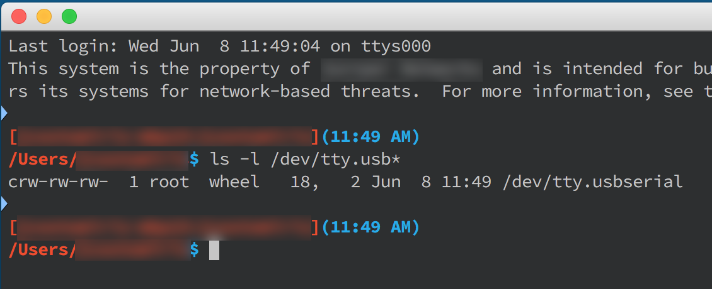
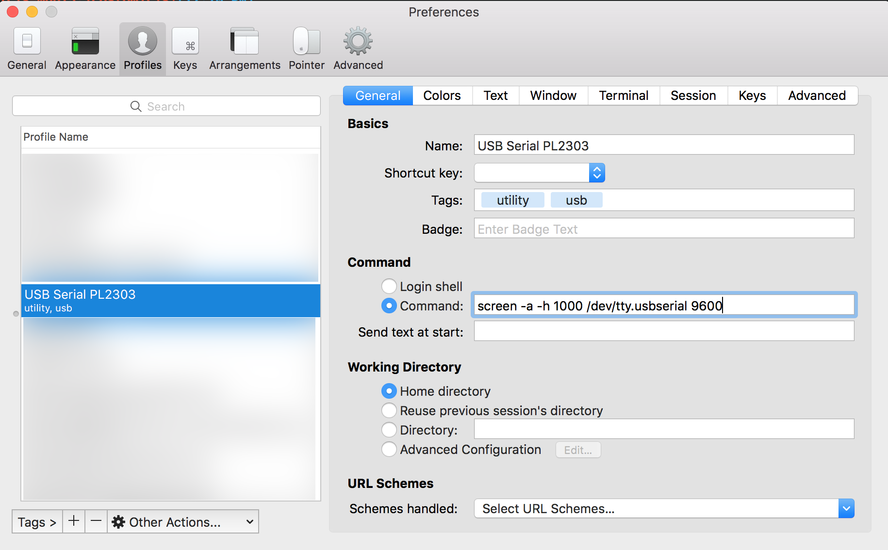

# MacOS X Serial Consoles Without (much) Pain

So, you came from the PC world where you just used Putty or SecureCRT to talk to your serial port to establish a console session to your favorite piece of network kit.  Now, you've got a Mac, and you're at a complete loss, right?  I was there once too.

## What USB Serial Device & Driver?

There are a ton of these out there, lots of different device drivers too.  Too many, in fact for you to want to spend a bunch of time figuring out which one is *the one*.  Some even require additional utilities to set preferences for the driver (speed, stop bits, etc.) - who needs that nonsense?  Not me.

I've had the best success with devices that implement the Prolific PL2303 chipset.  Here's a couple of examples from Amazon.  These aren't affiliate links, I promise.

* [TRENDnet](https://amzn.com/B0007T27H8) - My latest PL2303, works great, looks nicer than the Plugable (if that sort of thing is something you care about; I don't care so much about this), and was cheaper (1 of the 2 things I do care about - the other is "works well".)
* [Plugable](https://amzn.com/B00425S1H8) -  My first PL2303, still works.

Got your dongle?  Throw away the driver CD.  You don't need it. Go straight to [Prolific's website](http://www.prolific.com.tw/US/ShowProduct.aspx?p_id=229&pcid=41) and get the latest driver (v1.6.0 as of when this was written).

All installed and ready?  Plug in your dongle.  Crack open your favorite terminal and check to see if you've got /dev/tty.usbserial.  If you do, you're ready to move on.  If you don't, try rebooting first.



## Terminal Software & Connecting to the serial port

You're free to use the built-in Terminal that comes with Mac OS X.  It works really well, and in Yosemite and El Capitan (10.10 & 10.11), it's really matured significantly from the days of old.  Personally, I still like and use iTerm.  Years ago, iTerm v1 was pretty well abandoned, and then some other folks picked it up and started working on it again, in the form of iTerm2.  Just recently, they released iTerm2 3.0 (maybe we should talk about version numbers, hmm..?), and it's got lots of improvements. You should think about [going to their site and taking it for a spin](https://www.iterm2.com).

Got your Terminal going?  Ok, let's connect to a device.  Plug in the USB dongle, connect up to a console port and run this:

`$ screen /dev/tty.usbserial 9600`

Personally, I like to trick it out a bit to support a scrollback buffer and make full use of the terminal.  So, my command is:

`$ screen -a -h 1000 /dev/tty.usbserial 9600`

Congratulations, you're now connected at 9600, 8n1, without flow control.  The trick?  Disconnecting.  It's quite a key sequence.

Control-A, Control-\ after those key sequences, you'll have to confirm with a y/n to kill screen and destroy your session.  In a moment, I'll show you how to (surprise!) automate this whole setup.

## Automating iTerm2 for Easy Connect & Disconnect

### Connect - Make a Profile

In iTerm2's preferences, go to Profiles and make a profile for this.  You may just want to duplicate your default profile and modify the copy.  Here's what mine looks like:



Activate this profile by going to the Profiles menu in iTerm2, or go to the Toolbelt menu, show the Toolbelt and select Profiles.

### Disconnect - Make an AppleScript

If you're like me, you've already got enough stuff rattling around in your head.  Remembering Control-A, Control-\, y just wasn't happening for me.  For a while, I had a fragment of a Post-It Note inside my computer that had the magic key sequence.  I got tired of that, so I dug around a bit, and found that since iTerm2 exposes itself to AppleScript, I could get AppleScript to do the dirty work for me.  Fire up Script Editor and make a script.  Here's the entire script.

```AppleScript
tell application "iTerm"
	activate
	tell application "System Events"
		keystroke "a" using control down
		keystroke "\\" using control down
		keystroke "y"
	end tell
end tell
```
Save this script in ~/Library/Application Support/iTerm/Scripts.  Create this directory if you must.  Restart iTerm2 and you should have a menu called Scripts, located between Profiles and Toolbelt.  When you're ready to disconnect a console session, run the script from the Scripts menu.
